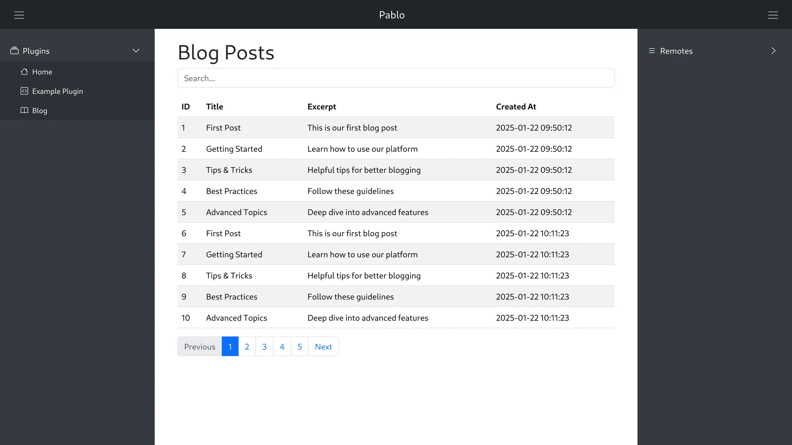

# Pablo - A Modern Micro Framework For PHP

Pablo is a lightweight, modern PHP micro-framework designed with simplicity and extensibility in mind. Built for PHP 8.4+, it provides a robust foundation for building web applications with a focus on modularity through its plugin architecture and theme system.

## Features

- **Modern PHP Support**: Built for PHP 8.4+ leveraging modern language features
- **Plugin Architecture**: Extensible plugin system for modular functionality
- **Theme System**: Flexible theming capabilities with support for multiple themes
- **Security First**: Built-in CSRF protection and secure session handling
- **API Support**: Native support for JSON API endpoints
- **Multiple Output Formats**: Supports HTML, JSON, text, and partial content rendering
- **PSR-4 Compliant**: Follows PHP-FIG standards for autoloading and code organization
- **Minimal Dependencies**: Zero external dependencies for the core framework
- **Debug Mode**: Comprehensive debug logging for development



## Requirements

- PHP 8.4 or higher
- Web server with URL rewriting capabilities (Apache, Nginx, etc.)
- Composer for dependency management

## Installation

1. Create a new project using Composer:
```bash
composer create-project markc/pablo your-project-name
```

2. Copy the environment configuration:
```bash
cp .env.example .env
```

3. Configure your web server to point to the `public` directory

## Project Structure

```
pablo/
├── db/                 # Database files (if used)
├── public/            # Public directory (web root)
│   ├── assets/       # Static assets (CSS, JS, images)
│   └── index.php     # Application entry point
├── src/              # Source code
│   ├── Core/         # Framework core components
│   ├── Exceptions/   # Custom exception classes
│   ├── Interfaces/   # Framework interfaces
│   ├── Plugins/      # Plugin directory
│   └── Themes/       # Theme directory
└── tests/            # Unit tests
```

## Plugin System

Pablo's plugin system allows you to extend the framework's functionality in a modular way. Each plugin is a self-contained module that can:

- Handle specific routes
- Add new functionality
- Integrate with the theme system
- Process API requests

### Creating a Plugin

1. Create a new directory in `src/Plugins/YourPlugin`
2. Create a `Plugin.php` file that extends the base Plugin class:

```php
namespace Markc\Pablo\Plugins\YourPlugin;

use Markc\Pablo\Core\Plugin;

class Plugin extends Plugin
{
    public function execute(): mixed
    {
        // Your plugin logic here
        return 'Plugin content';
    }
}
```

## Theme System

Pablo includes a flexible theme system that allows you to customize the appearance and layout of your application.

### Creating a Theme

1. Create a new directory in `src/Themes/YourTheme`
2. Create a `Theme.php` file that extends the base Theme class:

```php
namespace Markc\Pablo\Themes\YourTheme;

use Markc\Pablo\Core\Theme;

class Theme extends Theme
{
    public function render(): string
    {
        // Your theme rendering logic
        return '<!DOCTYPE html>...';
    }
}
```

## Configuration

Pablo uses a simple configuration system through environment variables and the Config class. Key configuration options include:

- `APP_DEBUG`: Enable/disable debug mode
- `APP_ENV`: Application environment (development, production)
- Theme selection
- Plugin settings

## Output Formats

Pablo supports multiple output formats:

- **HTML**: Default output format for web pages
- **JSON**: For API responses
- **Text**: Plain text output (strips HTML tags)
- **Partial**: Render specific sections for AJAX requests

## Security Features

- CSRF token protection for forms and API requests
- Secure session handling with HTTP-only cookies
- Strict Content Security Policy headers
- Input sanitization

## Development

To run the test suite:

```bash
composer test
```

Debug mode can be enabled by setting `APP_DEBUG=true` in your `.env` file.

## Contributing

Contributions are welcome! Please feel free to submit a Pull Request.

## License

Pablo is open-source software licensed under the [AGPL-3.0 license](LICENSE).

## Author

Created and maintained by Mark Constable (markc@renta.net)
